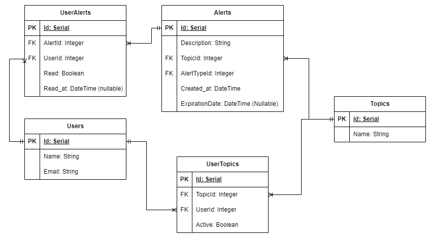

# Proyecto de Gestión de Alertas
Este proyecto permite la creación, envío y gestión de alertas de distintos tipos (informativas y urgentes) asociadas a usuarios y temas (topics). Las alertas pueden ser leídas por los usuarios, y el sistema se encarga de notificar a los usuarios sus alertas no leídas y no expiradas, clasificándolas según la urgencia.

## Tabla de Contenidos
1. Descripción General
2. Requisitos
3. Modelo Entidad-Relación (DER)
4. Funcionalidades Principales
5. Ejecución de Pruebas
6. Tecnologías Utilizadas

## Descripción General
El sistema está diseñado para gestionar alertas que pueden ser de tipo urgente o informativa. Los usuarios pueden estar suscritos a diferentes temas (topics) y recibir alertas según estas suscripciones.

El flujo principal del proyecto es:
1. Creación y envío de alertas.
2. Gestión de alertas no leídas y no expiradas.
3. Ordenamiento de alertas por urgencia y fecha.
4. Notificación de alertas a los usuarios.

## Requisitos
* PHP 8.1 o superior
* Composer
* PHPUnit

## Modelo Entidad-Relación (DER)

Este diagrama muestra la relación entre entidades principales como Alert, User, Topic, y UserAlert.




## Funcionalidades Principales

Todas las funcionalidades requeridas en el ejercicio se encuentran en el proyecto. Se listan a continuación solo algunas de las funcionalidades principales:
1. Crear y Enviar Alerta
Las alertas pueden ser creadas y enviadas a un usuario específico o a todos los usuarios suscritos a un tema.

* Código: [AlertService::createAndSendAlert](./app/Services/AlertService.php#L39)

2. Obtener alertas no leídas y no expiradas por usuario
Permite obtener las alertas que un usuario no ha leído y que no han expirado.

* Código: [AlertService::getUnreadUnexpiredAlertsByUser](./app/Services/AlertService.php#L64)

3. Obtener alertas no expiradas por tema
Obtiene todas las alertas activas para un tema en particular, las ordena según el tipo de alerta y la fecha de creación.

* Código: [AlertService::getUnexpiredAlertsByTopic](./app/Services/AlertService.php#L78)

4. Ordenar alertas por tipo y fecha
Las alertas se ordenan de manera que las alertas urgentes aparezcan primero (LIFO), y las alertas informativas después (FIFO).

* Código: [AlertService::sortAlertsByTypeAndDate](./app/Services/AlertService.php#L125)

5. Identificar si una alerta es global
Determina si una alerta es global, es decir, si fue enviada a más de un usuario.

* Código: [AlertService::alertIsGlobal](./app/Services/AlertService.php#L154)

6. Enviar alerta a un usuario específico
Envía una alerta directamente a un usuario.

* Código: [AlertService::sendAlertToUsers](./app/Services/AlertService.php#L45)

7. Enviar alerta a todos los usuarios suscritos a un tema
Envía una alerta a todos los usuarios que estén suscritos a un tema en particular.

* Código: [AlertService::sendAlertToUsers](./app/Services/AlertService.php#L50)

8. Crear una alerta
Permite la creación de una nueva alerta.

* Código: [AlertRepository::createAlert](./app/Repositories/AlertRepository.php#L20)

9. Obtener alertas por ID
Obtiene una alerta específica usando su ID.

* Código: Código: [AlertRepository::getAlertById](./app/Repositories/AlertRepository.php#L30)

10. Obtener alertas por tema
Obtiene todas las alertas que pertenecen a un tema específico.

* Código: [AlertRepository::getAlertsByTopic](./app/Repositories/AlertRepository.php#L40)

11. Obtener alertas no leídas por usuario
Obtiene las alertas que un usuario aún no ha marcado como leídas.

*  Código: [UserAlertRepository::getUnreadUserAlertsByUser](./app/Repositories/UserAlertRepository.php#L20)

## Ejecución de Pruebas
El proyecto incluye pruebas unitarias para validar las 11 funcionalidades. Para ejecutar las pruebas, usa el siguiente comando:

```bash
php artisan test

```

### Pruebas para Funcionalidades Específicas
|Funcionalidad	                                       |Método de Test   |
|------------------------------------------------------|-----------------|
|Crear y enviar alerta	                               |AlertServiceTest::testCreateAndSendAlert               |
|Obtener alertas no leídas y no expiradas por usuario  |AlertServiceTest::testGetUnreadUnexpiredAlertsByUser   |
|Obtener alertas no expiradas por tema                 |AlertServiceTest::testGetUnexpiredAlertsByTopic        |
|Ordenar alertas por tipo y fecha	                   |AlertServiceTest::testSortAlertsByTypeAndDate          |
|Identificar si una alerta es global	               |AlertServiceTest::testAlertIsGlobal                    |

## Tecnologías Utilizadas
PHP 8.1+ - Lenguaje de programación principal.
PHPUnit - Framework de pruebas unitarias.
